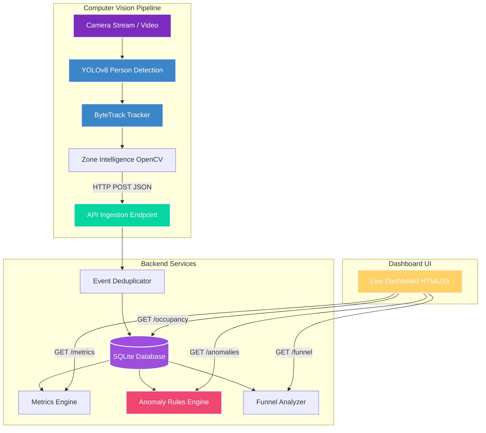

# 🏬 Purplle Store Intelligence System

An end-to-end, production-ready **Store Intelligence & Video Analytics System** that processes retail camera feeds in real-time, runs computer vision tracking (YOLOv8 + ByteTrack), detects shopper zone transitions, performs real-time anomaly detection, and serves a premium dark-glassmorphic analytics dashboard.

---

## 🏗️ System Architecture

The system is split into three primary layers:
1. **CV Tracking Pipeline**: YOLOv8 person detection and ByteTrack multi-object tracking are used to follow shoppers. A 2D spatial polygon collision algorithm (OpenCV) detects when shoppers cross store zone boundaries (Entrance, Shelf A, Shelf B, Billing Counter, Exit), generating and posting events to the ingestion API.
2. **FastAPI Backend & Analytics Engine**: A fast, asynchronous HTTP API layer that ingests event batches, validates schemas using Pydantic, stores events in a SQLite database with bulk deduplication, computes metrics, and runs active anomaly detection rules.
3. **Glassmorphic UI Dashboard**: A single-page web dashboard built using HTML, custom Vanilla CSS, and Chart.js that pulls live data from the backend every 3 seconds to display stats, occupant counts, funnel conversion rates, and warning alerts.



---

## 💾 Database Schema

The database is built on **SQLite** using **SQLAlchemy** for Object-Relational Mapping (ORM) and automatic migrations. It consists of a single high-performance `events` table:

| Column | Type | Description |
| :--- | :--- | :--- |
| `event_id` (PK) | String | Unique UUID for deduplicating incoming camera events. |
| `store_id` (Index) | String | Identifier for the retail store. |
| `camera_id` | String | Identifier for the source camera (e.g. entrance, shelf, billing). |
| `visitor_id` (Index) | String | Tracking ID assigned to the shopper (retained across frames). |
| `event_type` | String | Type of event: `ENTRY`, `EXIT`, `ZONE_ENTER`, `ZONE_EXIT`, `DWELL`, `PURCHASE`. |
| `timestamp` | DateTime | Local ISO timestamp of the event. |
| `zone_id` | String | Zone of the event: `Entrance`, `Shelf A`, `Shelf B`, `Billing Counter`, `Exit` (Nullable). |
| `dwell_ms` | Integer | Dwell time in milliseconds (set on exits or dwell events). |
| `is_staff` | Boolean | Flags if the tracked object is identified as a staff member (default false). |
| `confidence` | Float | Model detection/tracking confidence score. |
| `metadata` | JSON | Extra payload attributes (e.g. transaction amount, purchase items). |

---

## ⚡ API Endpoint Documentation

All backend endpoints are documented interactively via Swagger at `http://127.0.0.1:8000/docs`.

### Ingestion API
* **`POST /events/ingest`**: Ingests a batch of shopper events.
  - *Deduplication*: Automatically checks if any `event_id` is already present in the database and skips it in bulk to ensure data integrity and prevent network retry duplication.

### Analytics & Metrics APIs
* **`GET /stores/{store_id}/metrics`**: Returns key store performance metrics:
  - `footfall`: Total unique customer entrances.
  - `unique_visitors`: Total unique visitor IDs recorded.
  - `avg_dwell_time_ms`: Average duration visitors spent in the store or zones.
  - `peak_hour`: The 24-hour hour window (0-23) with the highest entrance frequency.
* **`GET /stores/{store_id}/funnel`**: Returns conversion funnel counts and metrics:
  - `visitors_entered`: Count of unique visitors entering.
  - `visitors_visited_shelf`: Count of unique visitors exploring Shelf A or Shelf B.
  - `visitors_billed`: Count of unique visitors check-out or billing.
  - `conversion_rate`: Percentage of entering visitors who completed a billing transaction.
* **`GET /stores/{store_id}/occupancy`**: Returns live occupancy distribution across the 5 spatial zones.
* **`GET /stores/{store_id}/anomalies`**: Evaluates active database entries against the real-time rules engine.

### System & Simulation APIs
* **`GET /health`**: Returns system status, DB connectivity validation, and timezone metadata.
* **`POST /simulation/reset`**: Clears all database tables for a fresh test.
* **`POST /simulation/mock`**: Seeds the database with a 1-hour synthetic shopper timeline, including realistic trajectories, billing check-outs, and active anomalies.

---

## 🚨 Anomaly Detection Rules Engine

The system runs real-time checks across the database to log critical anomalies:
1. **Camera Failure (`CAMERA_FAILURE`)**: Triggers if a camera hasn't pushed an event for > 2 minutes (severity: `CRITICAL`).
2. **Long Billing Queue (`LONG_QUEUE`)**: Triggers if the number of active visitors currently residing in the `Billing Counter` zone (entered billing but no exit event yet) exceeds 5 (severity: `WARNING`).
3. **Sudden Footfall Spike (`FOOTFALL_SPIKE`)**: Triggers if the number of entries in the last 5 minutes is > 3x the running 5-minute average of the preceding hour (severity: `WARNING`).
4. **Empty Store (`EMPTY_STORE`)**: Triggers if the store occupancy is 0 during core business hours (9:00 AM - 9:00 PM) for more than 30 minutes (severity: `WARNING`).

---

## 🖥️ Getting Started

### Prerequisites
- Python 3.13
- OpenCV system packages (if running CV script locally on Linux, install `libgl1` and `libglib2.0-0`)

### Local Setup & Activation

1. **Activate the Virtual Environment**:
   ```powershell
   # Windows (Powershell)
   .\venv\Scripts\Activate.ps1
   
   # macOS/Linux
   source venv/bin/activate
   ```

2. **Install local dependencies**:
   ```bash
   pip install -r requirements.txt
   ```

3. **Run the FastAPI Web Server**:
   ```bash
   uvicorn app.main:app --reload --host 127.0.0.1 --port 8000
   ```
   Open `http://127.0.0.1:8000/` in your browser to view the interactive live dashboard.

---

## 📹 Running the Computer Vision Pipeline

The CV pipeline resides in `pipeline/cv_pipeline.py`. It is equipped with two execution modes.

### Mode A: Interactive 2D Simulator (Default)
Renders a virtual floorplan window using OpenCV. Circle avatars representing shoppers move between zones, update zone states, and automatically POST tracking logs to the local FastAPI ingestion API.
```bash
python pipeline/cv_pipeline.py
```

### Mode B: YOLOv8 Real-Time Video Tracker
Loads the YOLOv8 model, runs person class filtering, hooks into ByteTrack, tracks positions, checks polygon boundaries, and posts events in real-time.
```bash
# Track from Web Camera (index 0)
python pipeline/cv_pipeline.py --yolo 0

# Track from a video file asset
python pipeline/cv_pipeline.py --yolo path/to/video.mp4
```

---

## 🐳 Docker Deployment

To build and run the entire store intelligence web server in an isolated, production-ready Docker container:

1. **Build and start the container**:
   ```bash
   docker-compose up --build -d
   ```
2. **Access the system**:
   - Web Dashboard: `http://localhost:8000/`
   - Interactive API docs: `http://localhost:8000/docs`
   - Database Persistence: SQLite file is mounted locally at `./store.db` to prevent data loss.
